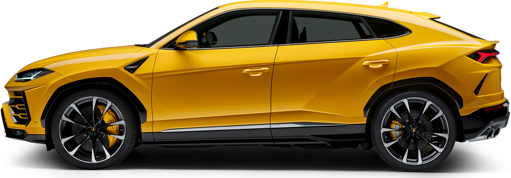

# Sport Car Rental App UI

**Flutter sport car rental UI.**

## Project Overview

This project is a Flutter-based user interface for a luxury sports car rental application. It demonstrates a modern, clean, and animated UI designed to provide an engaging user experience. The application showcases various screens for browsing cars, viewing details, and simulating a booking process, all built with a focus on responsive design and smooth animations.

## Problem Statement

In the competitive car rental market, a high-quality, visually appealing, and user-friendly mobile interface is a key differentiator. This project addresses the need for such an interface, providing a well-designed and intuitive UI that can serve as the foundation for a full-featured car rental application. The goal is to create a user experience that is both functional and aesthetically pleasing, making the process of renting a luxury car simple and enjoyable.

## Target Users / Use Cases

**Target Users:**
- Individuals looking to rent luxury and sports cars for personal or business use.
- Car enthusiasts who want to browse and explore different models.

**Use Cases:**
- **Browse Cars:** Users can scroll through a list of available sports cars on the home screen.
- **Search and Filter:** Users can search for specific cars and apply filters to narrow down the results.
- **View Car Details:** Users can tap on a car to view a detailed page with more images, specifications, and rental information.
- **Book a Car:** Users can select rental dates and simulate the booking process.

## Tech Stack

- **Frontend:** Flutter, Dart
- **Packages:**
  - `google_fonts`: For implementing custom fonts.
  - `responsive_sizer`: For creating a responsive and adaptive UI across different screen sizes.
  - `flutter_svg`: For using SVG images as assets.
  - `animate_do`: For adding animations to widgets.
  - `cached_network_image`: For caching images fetched from a network.
  - `omni_datetime_picker`, `calendar_date_picker2`, `intl`: For date and time selection in the booking process.

**Tags:** `flutter`, `dart`, `mobile-app`, `ui-ux`, `android-ios`

## Methodology / Workflow

The project was developed using a widget-based architecture, which is a core principle of Flutter development. The UI was built with a "mobile-first" approach, ensuring a seamless experience on mobile devices. Key aspects of the workflow include:

- **Responsive Design:** The `responsive_sizer` package was used to ensure that the UI elements and typography scale appropriately on different screen sizes, from small phones to large tablets.
- **Component-Based Structure:** The UI is broken down into reusable widgets, promoting a clean, maintainable, and scalable codebase.
- **Animations:** The `animate_do` package was used to add subtle and engaging animations, enhancing the overall user experience.
- **State Management:** For this UI-focused project, local state management (`StatefulWidget`) was sufficient. For a full-fledged application, a more robust state management solution like Bloc or Provider would be recommended.

## Project Structure

The project follows the standard Flutter project structure:

```
/
├── android/          # Android specific files
├── assets/           # Images, fonts, and other assets
│   ├── fonts/
│   ├── icons/
│   └── img/
├── ios/              # iOS specific files
├── lib/              # Main source code
│   ├── main.dart     # App entry point
│   ├── pages/        # Different screens of the app
│   └── utils/        # Utility classes and constants
├── pubspec.yaml      # Project dependencies and configuration
└── README.md         # Project documentation
```

## Key Features

- **Home Page:** A visually appealing home screen that displays a list of available sports cars, along with search and filter options.
- **Detail Page:** A detailed view of each car, showcasing multiple images, specifications, and rental prices.
- **Booking Page:** A user-friendly booking screen with a calendar for selecting rental dates.
- **Animations:** Smooth and elegant animations for a dynamic and interactive user experience.
- **Responsive UI:** The layout and elements are fully responsive and adapt to various screen sizes.

## Data Source & Preprocessing

For this UI prototype, the application uses static data. All car information, including images and specifications, is stored locally within the `assets` folder. In a production environment, this data would be fetched from a backend server via API calls.

## Challenges & Solutions

- **Challenge:** Ensuring a consistent and visually appealing UI across a wide range of devices with different screen sizes and aspect ratios.
  - **Solution:** The `responsive_sizer` package was implemented to use relative sizing for widgets and fonts, allowing the UI to adapt gracefully to different screen dimensions.
- **Challenge:** Creating smooth and performant animations without overcomplicating the codebase.
  - **Solution:** The `animate_do` package was used to easily apply pre-built animations to widgets, which improved the user experience while keeping the code clean and readable.

## Model Performance / Evaluation Metrics

This section is not applicable as this is a UI-focused project and does not involve any machine learning models.

## Results & Impact

The result of this project is a high-fidelity, interactive UI prototype for a sports car rental application. This prototype can be used to:
- Demonstrate the look and feel of the final application to stakeholders.
- Serve as a solid foundation for the development of a full-featured application, significantly reducing UI development time and effort.
- Provide a reusable and scalable codebase for future projects.

## Demo / Screenshots

*(Please add your screenshots or a GIF demo here. You can use the images from the `assets/img` directory as a reference.)*

**Home Page**


**Detail Page**


**Booking Page**


## Future Improvements

- **Backend Integration:** Connect the application to a backend server to manage car inventory, bookings, and user data dynamically.
- **User Authentication:** Implement a complete user authentication system with sign-up, login, and profile management features.
- **Payment Gateway Integration:** Integrate a payment gateway to allow users to make real payments for their bookings.
- **Advanced Search and Filtering:** Add more advanced search and filtering options, such as filtering by brand, price range, and availability.
- **State Management:** Implement a robust state management solution like Bloc or Provider to handle the application state more efficiently as the app grows in complexity.

## Lessons Learned

- **Responsive UI in Flutter:** Gained hands-on experience in building responsive and adaptive UIs using the `responsive_sizer` package.
- **Animations for UX:** Learned how to use animations to enhance the user experience and create a more dynamic and engaging interface.
- **Project Structuring:** Developed a better understanding of how to structure a Flutter project for scalability and maintainability by separating pages, widgets, and utilities.
- **Importance of UI/UX:** Reinforced the importance of a well-designed UI/UX in creating a successful mobile application.

## Installation & Setup Guide

To run this project locally, follow these steps:

1. **Clone the repository:**
   ```bash
   git clone https://github.com/your-username/Rental-Sport-Car-UI-Flutter.git
   ```
2. **Navigate to the project directory:**
   ```bash
   cd Rental-Sport-Car-UI-Flutter
   ```
3. **Install dependencies:**
   ```bash
   flutter pub get
   ```
4. **Run the application:**
   ```bash
   flutter run
   ```

## Credits / Acknowledgments

- This project was built using [Flutter](https://flutter.dev/).
- Thanks to the creators of the open-source packages used in this project.
- UI design inspired by various concepts on Dribbble and Behance.
